### Music Web

A simple music web, use pure css, oringal js, and jinjia2 html.flask as&#x20;

### install

```python
pip install requests
pip install pyexecjs2
pip install flask
pip install pymysql
pip install flask-sqlalchemy
pip install wtforms
pip install jieba
pip install werkzeug
npm install crypto-js
```

### useage

this web use aplyer and demo in codepen

you need edit the config.py to add your own config

sql file not privided, if needed,you can buy it from me

all models are included,once you build the database,you can use this web

provides route to add song to the database(in user blueprint)

you need edit two files,first is wangyi.py in crawl_model dir, add your cookie. Then edit config, add your own database

### function

*   login/logout
*   recommend
*   playlist
*   history
*   collected
*   play/play index
*   scroll lyrics
*   add song to the database
*   create playlist and edit
*   delete playlist
*   search song
*   upload avatar or playlist cover
*   ...

### details
##### Home Page
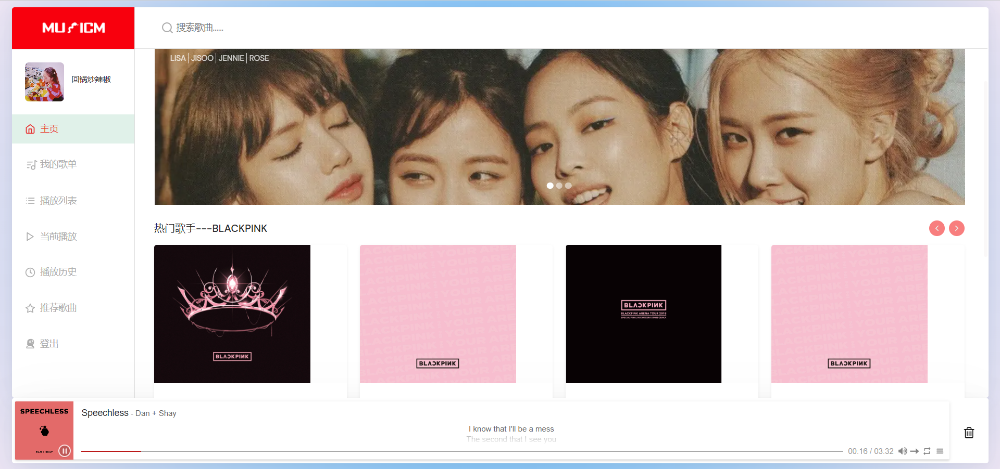
##### Search Page
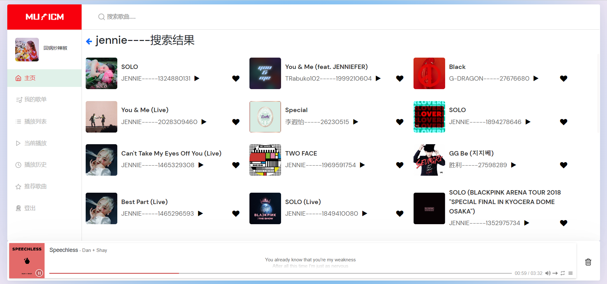
##### Playlist Page
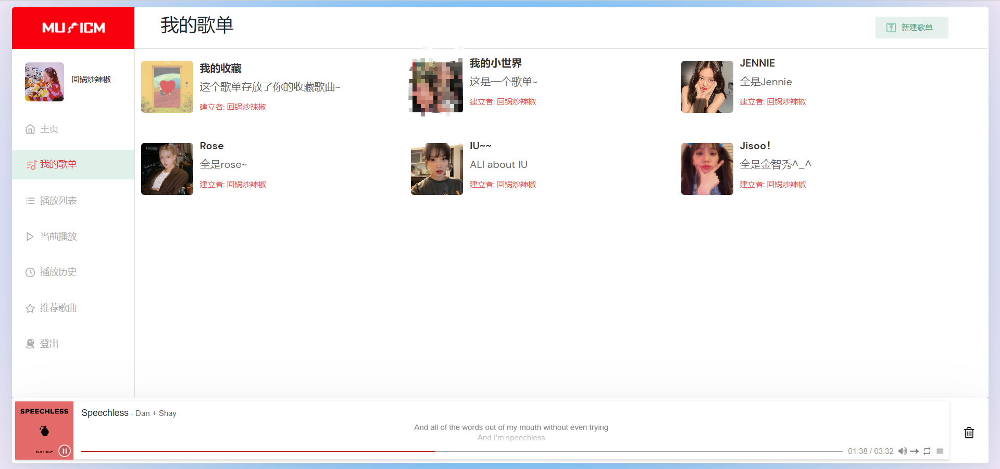
##### Create Playlist
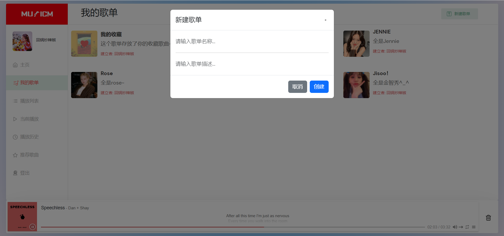
##### Playlist Index Page
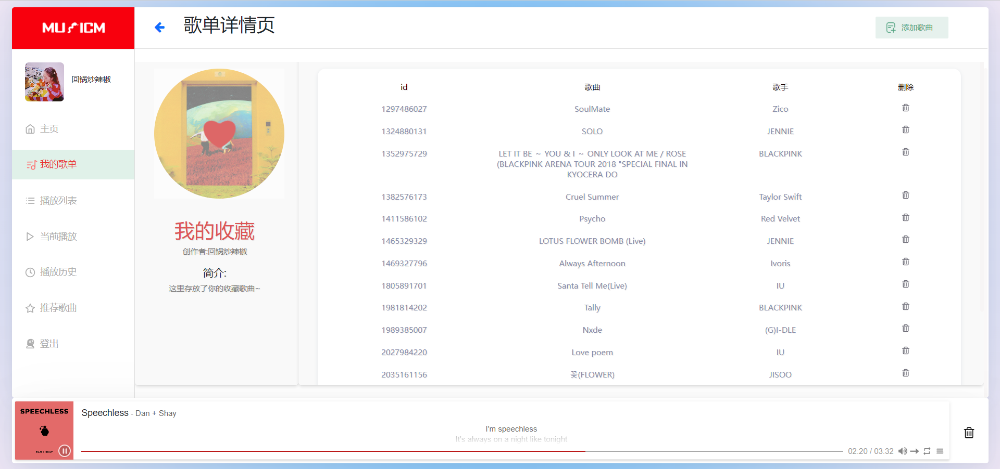
##### Now Playing List Page
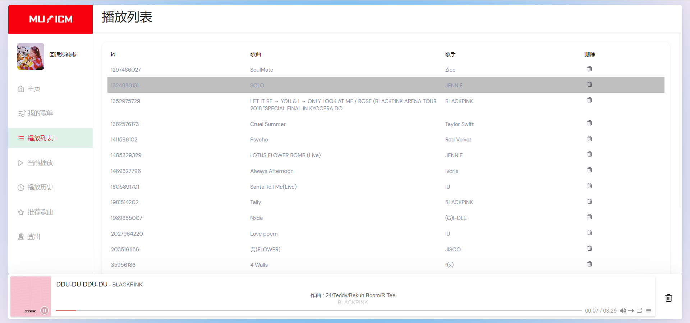
##### Now Playing Page
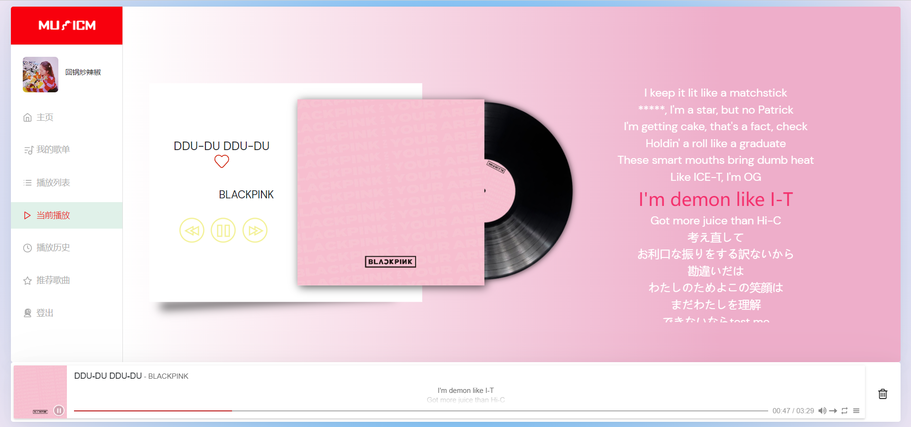
##### History Page
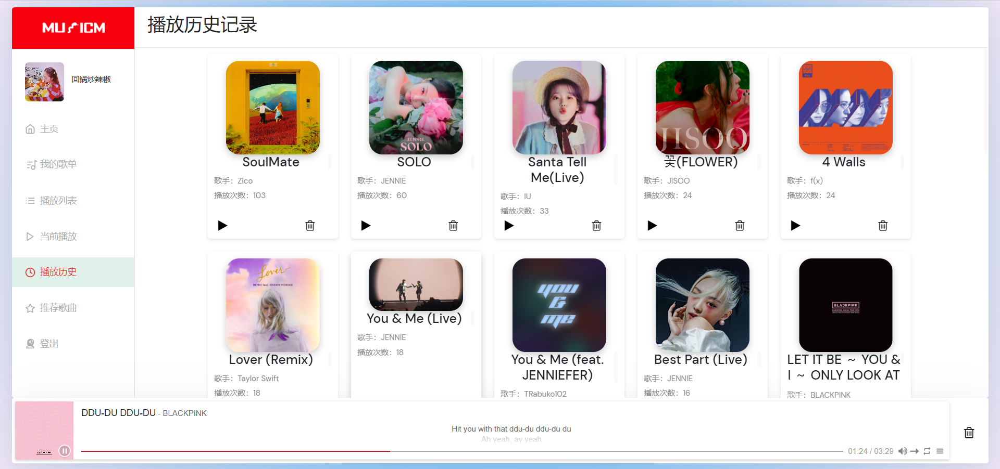
##### Recommend Page
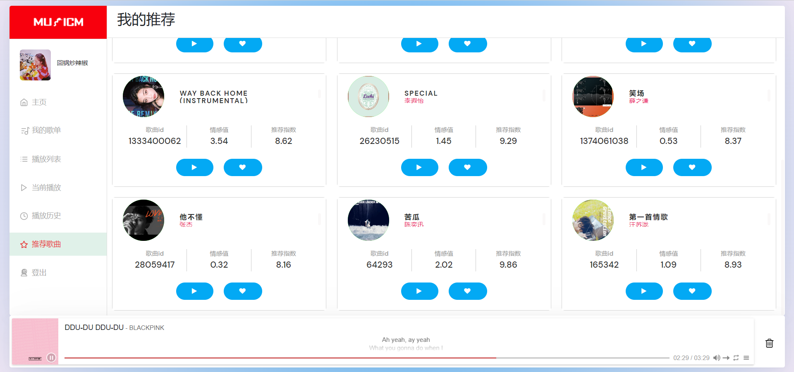
##### Login and Register Page
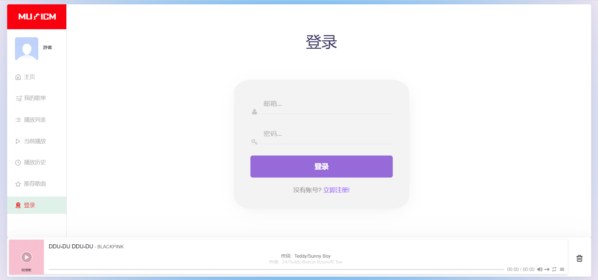
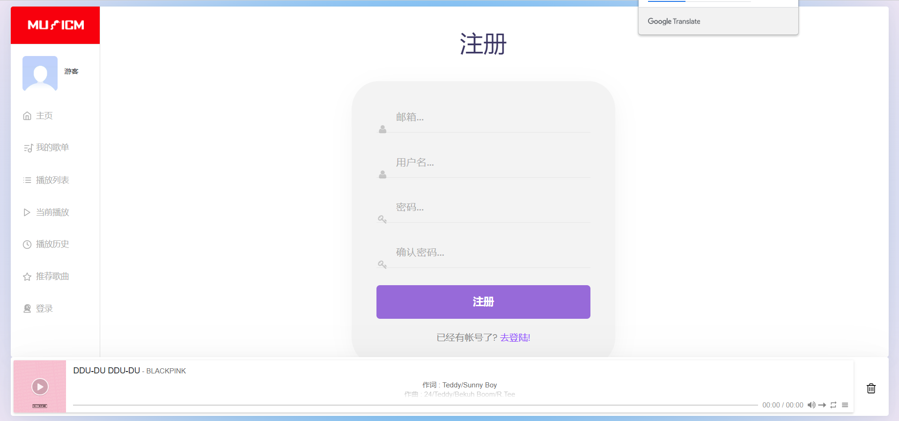